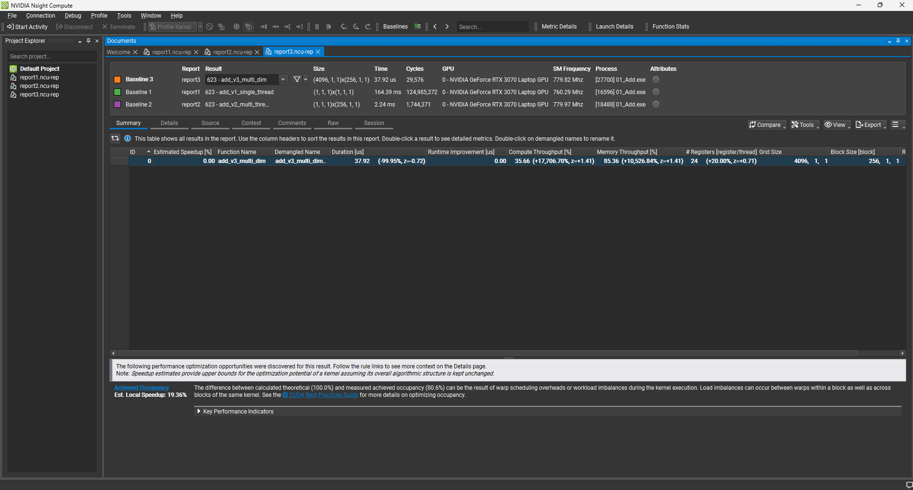

# Project 01: Vector Addition Optimization

## Overview
This project implements element-wise vector addition using CUDA.
The goal was to move from a naive CPU-like implementation to a fully optimized, scalable GPU kernel. I profiled each version to analyze the performance impact of parallelization strategies.

**Target Data Size:** 1,000,000 elements (float)

## Implementation Details

I iterated through three kernel versions to understand thread hierarchy and scalability:

### 1. v1_single_thread (Naive)
- **Strategy:** Runs the kernel with a single thread block containing only 1 thread (`<<<1, 1>>>`).
- **Bottleneck:** Serialization. It effectively runs as sequential CPU code on the GPU, incurring overhead without any parallelism benefit.

### 2. v2_single_block (Basic Parallelism)
- **Strategy:** Utilizes multiple threads (256) but confines them to a single thread block (`<<<1, 256>>>`).
- **Mechanism:** Basic parallel execution within one Streaming Multiprocessor (SM).
- **Limitation:** Hardware Underutilization. The kernel cannot scale beyond 1024 threads (1 block limit) and leaves the rest of the GPU idle.

### 3. v3_grid_stride (Optimized)
- **Strategy:** Implements the **Grid-Stride Loop** pattern with calculated grid dimensions (`<<<numBlocks, 256>>>`).
- **Advantage:** Decouples grid size from data size.
- **Result:** The kernel scales to any input size and fully saturates the GPU hardware, achieving massive speedup.

## Performance Analysis

Results captured using **NVIDIA Nsight Compute** (Release Build).

| Version | Execution Time | Speedup (vs v1) | Note |
| :--- | :--- | :--- | :--- |
| v1 (Single Thread) | ~164.39 ms | 1x | Baseline (Sequential) |
| v2 (Single Block) | ~2.24 ms | ~73x | Limited by Single Block |
| **v3 (Grid-Stride)** | **~37.92 us** | **~4,335x** | **Full Device Utilization** |

### Nsight Compute Profiling

**Performance Evolution**
*(Profiling results showing the dramatic execution time reduction in v3)*

> **Note:** The final version (v3) processes 1M elements in microseconds by effectively utilizing all available Streaming Multiprocessors (SMs) on the GPU.

## Key Takeaways
- **Grid-Stride Loops are essential:** They provide scalability and prevent kernel crashes when data size exceeds the maximum grid dimensions.
- **Launch Configuration matters:** Simply adding threads isn't enough; calculating the correct number of blocks (`(N + blockSize - 1) / blockSize`) is crucial for occupying the entire GPU.
- **Bottleneck Analysis:** Moving from "Single Thread" -> "Single Block" -> "Grid Stride" clearly demonstrated how hardware utilization directly correlates with throughput.