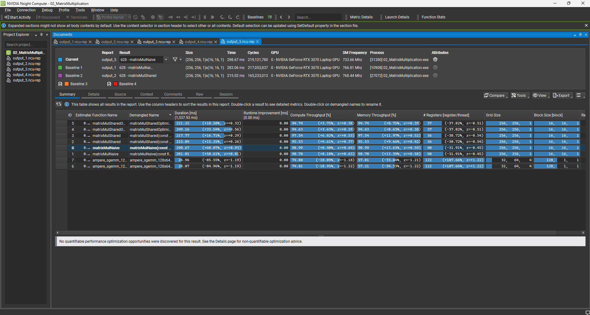
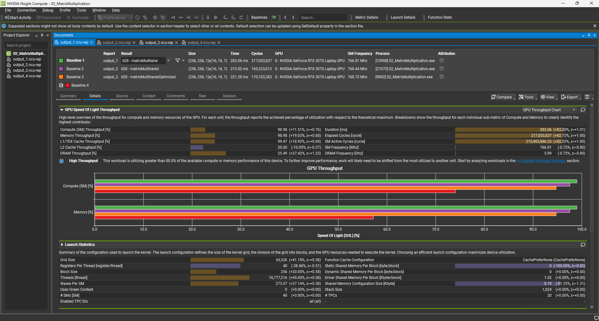

# Project 02: Matrix Multiplication Optimization

## Overview
This project implements Matrix Multiplication ($C = A \times B$) using CUDA, progressing from a naive implementation to memory-optimized versions.
The goal was to understand the GPU memory hierarchy (Global vs. Shared Memory) and analyze performance bottlenecks using **NVIDIA Nsight Compute**.

**Target Matrix Size:** 4096 x 4096 (float)

## Implementation Details

I iterated through three kernel versions to optimize memory access patterns:

### 1. Naive Implementation (Global Memory)
- **Strategy:** Directly accesses Global Memory for every arithmetic operation.
- **Bottleneck:** Memory Bound. Extreme latency due to lack of data reuse and uncoalesced memory accesses.

### 2. Shared Memory Tiling
- **Strategy:** Implements **Tiling** algorithms to load a block of data into **Shared Memory (L1 Cache)**.
- **Mechanism:** Reuses loaded data `BLOCK_SIZE` times within the thread block.
- **Improvement:** Significantly reduced Global Memory traffic by minimizing redundant accesses.

### 3. Vectorized Memory Access (float4)
- **Strategy:** Loads 4 floats (16 bytes) in a single instruction using `float4` data types.
- **Goal:** To maximize memory bandwidth utilization and reduce the total number of load instructions.
- **Observation:** While memory efficiency improved, the kernel became **Compute Bound** (arithmetic operations became the limiting factor), resulting in marginal gains over the standard Shared Memory kernel.

## Performance Analysis

Results captured using **NVIDIA Nsight Compute** (Release Build, RTX 3070 Laptop GPU).

| Version | Execution Time | Speedup (vs Naive) | Note |
| :--- | :--- | :--- | :--- |
| Naive Kernel | ~182.50 ms | 1.0x | Baseline (Memory Bound) |
| Shared Memory | ~135.91 ms | ~1.34x | Optimized Memory Access |
| **Shared + float4** | **~132.65 ms** | **~1.37x** | **Bottleneck Shifted to Compute** |
| cuBLAS (Reference) | ~14.87 ms | ~12.2x | Uses Register Tiling & Double Buffering |

### Nsight Compute Profiling

**1. Performance Summary**

*(Comparison of execution times: Naive vs Shared vs Optimized vs cuBLAS)*

**2. Speed of Light (SOL) Analysis**

*(The SOL chart shows high memory throughput in the Naive kernel transitioning to higher compute utilization in Optimized kernels)*

## Key Takeaways
- **Memory Hierarchy is key:** Utilizing Shared Memory (Tiling) is essential to overcome Global Memory latency in bandwidth-heavy algorithms.
- **Bottleneck Shifting:** Optimizing memory access (via `float4`) shifted the bottleneck from Memory to Compute. Further optimization would require **Register Tiling** to increase instruction-level parallelism.
- **Gap to Official Libraries:** The performance gap between manual optimization and cuBLAS highlights the importance of advanced techniques like double buffering and assembly-level tuning for production-grade code.