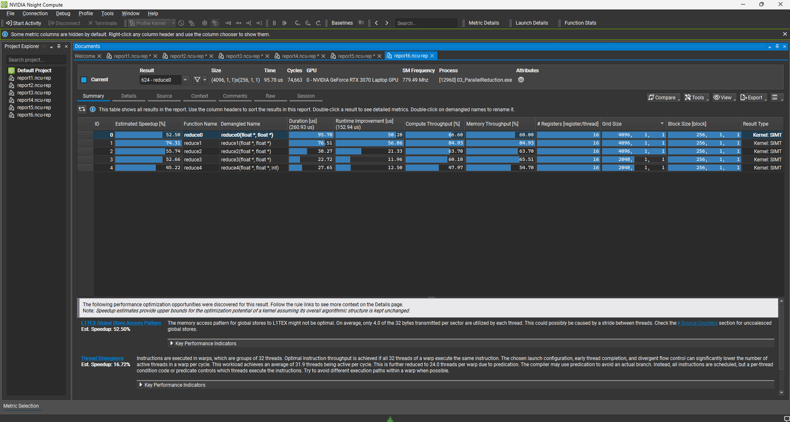
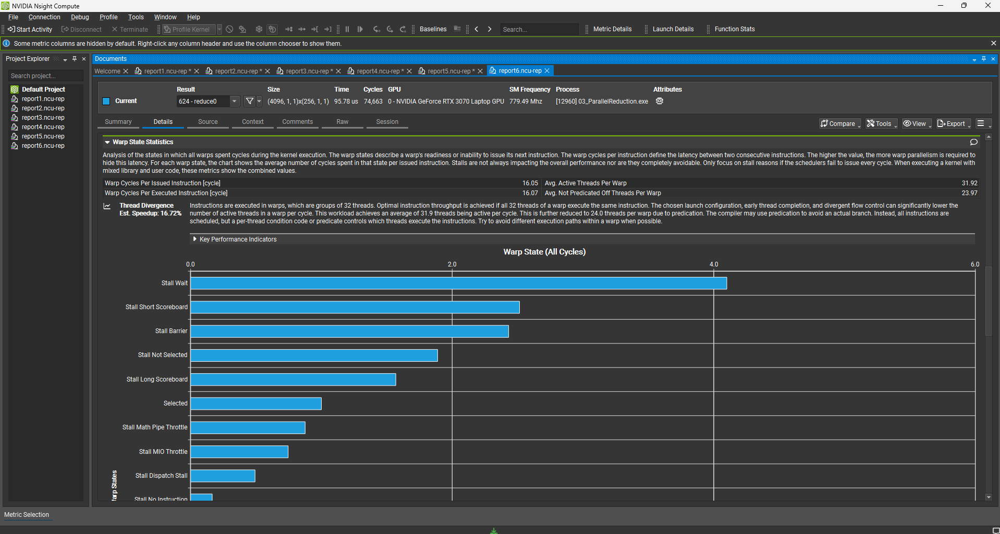
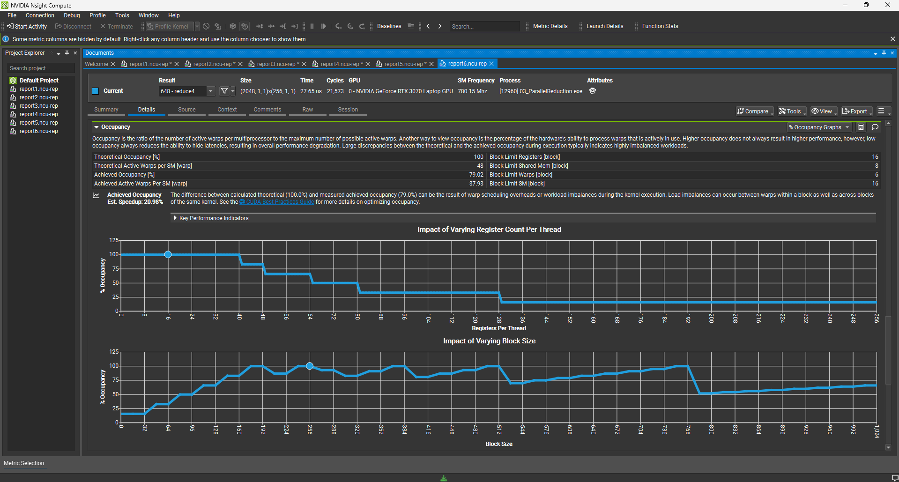

# Project 03: Parallel Reduction Optimization

## Overview
This project optimizes a Parallel Reduction algorithm (array summation) using CUDA, progressing from a naive implementation to a fully scalable, production-ready kernel.
The primary goal was to understand execution mapping on hardware (Warps) and eliminate performance bottlenecks like **Warp Divergence** and **Instruction Overhead**.

**Target Data Size:** 1,048,576 elements ($2^{20}$) (float)

## Implementation Details

I iterated through five kernel versions to systematically remove bottlenecks:

### 1. Naive Implementation (Interleaved Addressing)
- **Strategy:** Uses modulo arithmetic to determine active threads.
- **Bottleneck:** High **Warp Divergence**. Threads within the same warp take different execution paths (active vs. idle), causing serialization of the warp execution.

### 2. Sequential Addressing
- **Strategy:** Changed indexing to force continuous thread activation.
- **Improvement:** Solved warp divergence. Threads 0 through `BlockDim/2` remain active, ensuring entire warps are utilized while others are fully idle.

### 3. Loop Unrolling
- **Strategy:** Manually unrolled the reduction loop for the last 32 threads (one warp).
- **Technique:** Used the `volatile` keyword to enforce memory visibility without `__syncthreads()`, removing synchronization and loop control instruction overhead.

### 4. Algorithmic Cascading (Grid Halving)
- **Strategy:** Each thread performs an addition while loading data from Global Memory.
- **Improvement:** Increased Instruction Level Parallelism (ILP) and halved the required grid size, significantly reducing launch overhead.

### 5. Grid-Stride Loop (Final)
- **Strategy:** Decoupled grid size from data size. Threads loop through the data using a grid-stride pattern.
- **Goal:** Achieved full **Scalability**. This kernel can handle arrays of arbitrary size without modification and allows tuning of elements-per-thread for maximum throughput.

## Performance Analysis

Results captured using **NVIDIA Nsight Compute** (Release Build, RTX 3070 Laptop GPU).

| Version | Execution Time | Speedup (vs Naive) | Note |
| :--- | :--- | :--- | :--- |
| Naive Kernel | ~95.78 us | 1.0x | Severe Warp Divergence |
| Sequential Addressing | ~76.51 us | ~1.25x | Divergence Eliminated |
| Loop Unrolling | ~38.27 us | ~2.50x | Sync Overhead Removed |
| Algorithmic Cascading | **~22.72 us** | **~4.21x** | **Fastest (Limited Scalability)** |
| **Grid-Stride Loop** | ~27.65 us | ~3.46x | **Scalable & Robust (Production Ready)** |

### Nsight Compute Profiling

**1. Performance Summary**

*(Comparison of all 5 kernels. Note the dramatic latency reduction from Kernel 0 to Kernel 3)*

**2. Warp Divergence Analysis (Kernel 0)**

*(Nsight Compute explicitly warns about Thread Divergence in the Naive kernel, identifying it as the primary bottleneck)*

**3. Occupancy & Efficiency (Kernel 4)**

*(Kernel 4 shows high achieved occupancy, indicating efficient utilization of SM resources despite the loop overhead)*

## Key Takeaways
- **Warp Execution:** Understanding that threads execute in lockstep (Warps) is crucial. Branching within a warp destroys performance.
- **Instruction Overhead:** For light arithmetic kernels like addition, loop controls and synchronization barriers constitute a significant portion of execution time. Unrolling solves this.
- **Volatile Keyword:** In warp-synchronous programming, `volatile` is necessary to prevent compiler register caching and ensure shared memory visibility between threads.
- **Scalability:** Hardcoding block sizes limits utility. The Grid-Stride Loop pattern is essential for writing robust kernels that handle arbitrary data sizes.