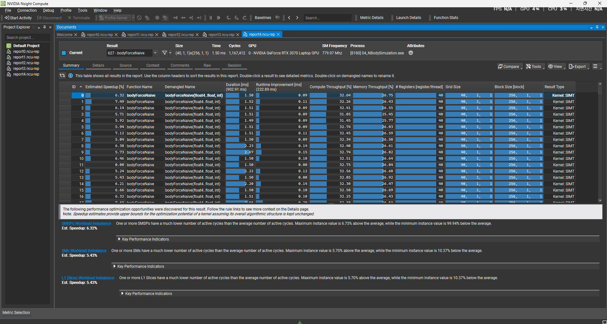
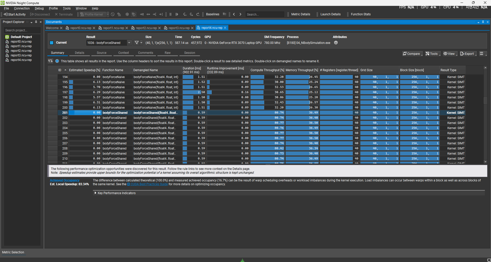
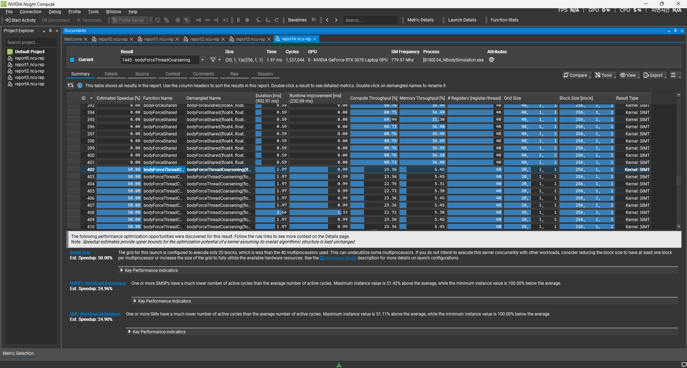
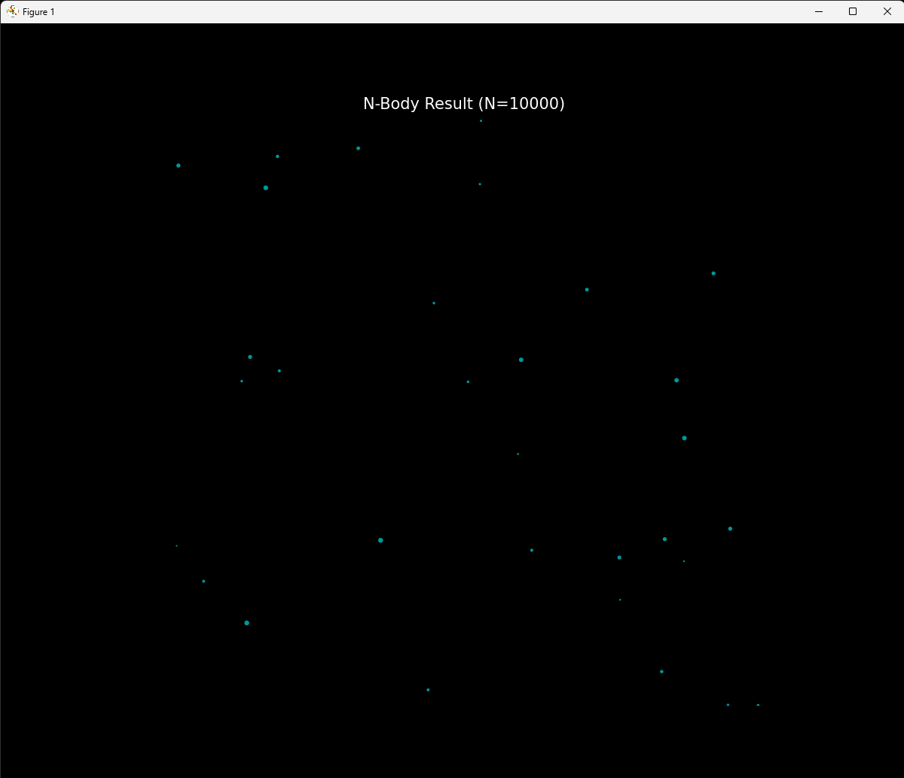

# Project 04: N-Body Simulation

## Overview
This project implements a high-performance $O(N^2)$ N-Body gravity simulation using CUDA. The simulation computes mutual gravitational forces between bodies, optimizing for both memory bandwidth and instruction throughput.
The primary goal was to transition a **Memory Bound** algorithm into a **Compute Bound** state by leveraging Shared Memory and analyzing the hardware trade-offs of Thread Coarsening on high-end GPUs.

**Target Hardware:** NVIDIA GeForce RTX 3070 Laptop GPU (46 SMs)

## Implementation Details

Three kernel versions were implemented to systematically address performance bottlenecks:

### 1. Naive Implementation
- **Strategy:** Each thread computes the force for a single body by iterating through all $N$ bodies in Global Memory.
- **Bottleneck:** Severe **Memory Bandwidth** saturation. The arithmetic intensity is too low to hide the latency of constant Global Memory accesses.

### 2. Shared Memory Tiling (Bandwidth Optimization)
- **Strategy:** Threads cooperatively load a "tile" of bodies (e.g., 256 elements) into on-chip **Shared Memory**.
- **Mechanism:** All threads in the block synchronize and reuse the cached data for calculations before loading the next tile.
- **Improvement:** Reduced Global Memory traffic by a factor of `BLOCK_SIZE` (256x), effectively shifting the bottleneck from memory to compute units.

### 3. Thread Coarsening (Instruction Optimization)
- **Strategy:** Each thread processes multiple bodies (Factor 2) to increase the ratio of arithmetic instructions to control flow instructions.
- **Trade-off:** Increases register pressure per thread and reduces the total number of thread blocks.

## Performance Analysis

### Scenario A: Small Dataset ($N = 10,000$)
At this scale, the GPU resources were not fully saturated by the Coarsening kernel.

| Kernel Version | Performance (GFLOPS) | Speedup | Bottleneck |
| :--- | :--- | :--- | :--- |
| Naive | ~1,500 GFLOPS | 1.0x | Global Memory Bandwidth |
| **Shared Memory Tiling** | **~6,680 GFLOPS** | **4.4x** | **Compute Limits (Optimal)** |
| Thread Coarsening (x2) | ~2,000 GFLOPS | 1.3x | **Low Occupancy** |

**Analysis of Coarsening Failure:**
With $N=10,000$ and a block size of 256, the standard kernel launches ~40 blocks. Since the RTX 3070 has 46 Streaming Multiprocessors (SMs), the GPU is well-utilized. However, Thread Coarsening (x2) halves the number of blocks to ~20. This leaves more than half of the GPU's SMs idle, resulting in a massive performance drop.

### Scenario B: Scaled Dataset ($N = 81,920$)
To verify the Coarsening hypothesis, the simulation size was increased to saturate the hardware.

| Kernel Version | Performance (GFLOPS) | Note |
| :--- | :--- | :--- |
| Naive | ~5,159 GFLOPS | Still Memory Bound |
| **Shared Memory Tiling** | **~6,806 GFLOPS** | **Peak Efficiency** |
| Thread Coarsening (x2) | ~6,443 GFLOPS | Occupancy recovered, nearly matches Tiling |

**Conclusion:**
When the grid size is sufficient to fill the GPU ($N=81,920$), Thread Coarsening recovers its performance, matching the Shared Memory kernel. However, it does not significantly outperform it on this architecture, suggesting that the compiler's optimization on the standard loop was already highly efficient or that register pressure limited further gains.

## Nsight Compute Profiling

**1. Bottleneck Identification (Naive)**

*The naive kernel shows low compute throughput (~32%) and high memory latency dependency.*

**2. Compute Saturation (Shared Memory)**

*The Shared Memory kernel achieves **>80% Compute Throughput**, indicating the hardware is being utilized to its theoretical limit.*

**3. Occupancy Issue (Coarsening at N=10k)**

*Profiling reveals the root cause of the performance drop: The grid size (20 blocks) is insufficient to occupy the available SMs on the RTX 3070.*

## Visualization

*Validation of the simulation logic (N=10,000).*