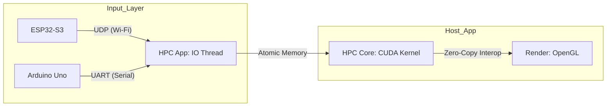
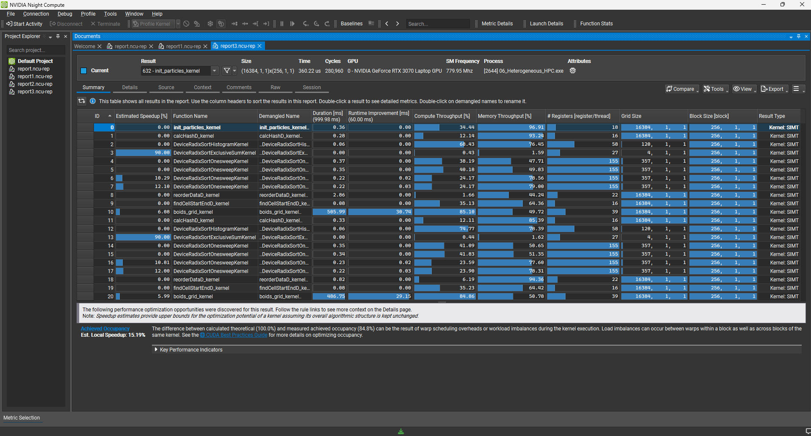

# Project 06: Heterogeneous HPC Simulation System


*(Real-time Boids Simulation controlled by Wireless ESP32 or Bare-metal Arduino Input)*

## Overview
This project builds a **Full-Pipeline Control System** that integrates External Hardware and a CUDA HPC Simulation.
The system mimics an **Embedded/HPC** architecture where an external input node controls a massive particle simulation ($N \ge 16,384$) in real-time via a dedicated hardware thread.

**Target Hardware:**
- **Host:** NVIDIA GeForce RTX 3070 Laptop GPU (46 SMs)
- **Wireless Node:** ESP32-S3 (Dual-core, Wi-Fi/BT) - *Wireless Mode*
- **Legacy Node:** Arduino Uno (ATmega328P) - *Bare-metal Mode*

## System Architecture

The system consists of three layers connected via a **Direct Memory Access (DMA) style** pipeline supporting dual-mode communication.



**(Text Representation)**
`[Input Node]` --(UDP/UART)--> `[IO Thread: Receiver]` --(Atomic Sync)--> `[HPC Thread: CUDA Physics]` --(Interop)--> `[Render: OpenGL]`

## Implementation Goals

### 1. HPC Core (Simulation Layer)
- **Objective:** Compute Bound Optimization.
- **Strategy:** Transition from $O(N^2)$ to $O(N)$ using **Spatial Partitioning (Uniform Grid)**.
- **Optimization:**
    - **Thrust Sort:** Reordering particles to maximize memory coalescence.
    - **OpenGL Interop:** Zero-copy rendering to eliminate CPU-GPU bandwidth overhead.

### 2. System Integration (I/O Layer)
- **Objective:** Asynchronous & Wireless Data Pipeline.
- **Mechanism:**
    - **Multi-threaded I/O:** Decoupled `UdpReceiver`/`SerialPort` thread from the `Rendering` thread.
    - **Wireless Integration:** Native C++ **WinSock2 UDP Receiver** handling ESP32 telemetry packets.
    - **Atomic Synchronization:** Thread-safe data sharing using `std::atomic<int>`.

### 3. Hardware (Input Layer)
- **Wireless Mode:** ESP32-S3 acting as a **SoftAP** broadcasting telemetry data at 100Hz.
- **Bare-metal Mode:** Direct register manipulation of `UBRR` and `ADCSRA` for raw hardware control.

## Directory Structure

```text
06_Heterogeneous_HPC/
├── Firmware/
│   ├── Wireless_Potentiometer_UDP.ino   # [Modern] ESP32 UDP Telemetry
│   └── BareMetal_Potentiometer.ino      # [Legacy] Register-level AVR Firmware
├── Simulation/                           # [HPC Core] Main Application
│   ├── UdpReceiver.h / .cpp              # WinSock2 UDP Implementation
│   ├── SerialPort.h / .cpp               # Win32 Serial Implementation
│   ├── kernel.cu / .cuh                  # CUDA Physics Kernels
│   └── main.cpp                         # OpenGL Loop & Threading
└── README.md
```

## Development Roadmap

### Phase 1: Core Engine (Complete)
- [x] **Step 1: OpenGL Interop Setup (Zero-Copy Visualization)**
- [x] **Step 2: Naive Boids Implementation ($O(N^2)$)**
- [x] **Step 3: Spatial Partitioning Optimization (Uniform Grid)**
    - **Performance Achieved:** 262,144 particles @ ~50 FPS (RTX 3070).

### Phase 2: System Integration (Complete)
- [x] **Step 4: Serial Communication Module**
    - Implemented `SerialPort` class using Win32 API.
- [x] **Step 5: Multi-threaded Integration**
    - Implemented `std::thread` worker for non-blocking I/O.
    - Real-time mapping of sensor data to CUDA constant memory.
    - **Result:** Dynamic Cohesion/Separation control via external hardware input.

### Phase 3: Hardware Control (Complete)
- [x] **Step 6: Bare-metal Firmware Implementation (Register Level)**
    - Replaced `analogRead` with `ADMUX`/`ADCSRA` register control.
    - Replaced `Serial.print` with `UBRR0`/`UDR0` UART control.

### [New] Wireless Modernization (Complete)
- [x] **Step 1: ESP32-S3 SoftAP Infrastructure**
- [x] **Step 2: WinSock2 UDP Receiver Threading**
- [x] **Step 3: Real-time Wireless Telemetry Mapping**


### Performance Analysis (Validated via Nsight Compute)

To verify the efficiency of the **Heterogeneous System Architecture**, I profiled the application while the hardware was actively sending data.


*(Profiling Data: Kernel execution during active I/O activity)*

**Key Findings:**
* **Zero I/O Overhead:** The execution time remained consistent regardless of incoming telemetry, proving successful thread decoupling.
* **Stable Latency:** Despite continuous network packets or hardware interrupts, the GPU simulation pipeline maintained a steady frame rate.

### Scalability & Stress Test (Pushing the Limits)

| Particle Count | Resolution | Performance | Compute Throughput |
| :--- | :--- | :--- | :--- |
| **16,384** | 128 x 128 | **~9,000+ FPS** (0.06ms) | 25.3% |
| **1,048,576** | 1024 x 1024 | **~50 FPS** (31.3ms) | **85.2%** |
| **4,194,304** | 2048 x 2048 | **~3 FPS** (500ms) | 85.1% |

**Key Insights & Lessons Learned:**
1. **Efficiency of Spatial Partitioning:** Compute Throughput spikes to 85% at 1M particles, proving the grid optimization effectively eliminated memory bottlenecks.
2. **The Hardware Threshold:** 1M particles is the real-time threshold for the RTX 3070 Laptop GPU (~50 FPS).
3. **Bottleneck Transition:**
    - **Small Scale (16K):** Bottleneck is Latency (I/O & Driver overhead).
    - **Large Scale (1M+):** Bottleneck is Throughput (Compute).