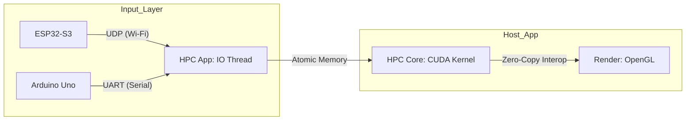

# Project 06: Heterogeneous HPC Simulation System


*(Real-time Boids Simulation controlled by Wireless ESP32 or Bare-metal Arduino Input)*

## Overview
This project builds a **Full-Pipeline Control System** that integrates External Hardware and a CUDA HPC Simulation.
The system mimics an **Embedded/HPC** architecture where an external input node controls a massive particle simulation ($N \ge 16,384$) in real-time via a dedicated hardware thread.

**Target Hardware:**
- **Host:** NVIDIA GeForce RTX 3070 Laptop GPU (46 SMs)
- **Wireless Node:** ESP32-S3 (Dual-core, Wi-Fi/BT) - *Wireless Mode*
- **Legacy Node:** Arduino Uno (ATmega328P) - *Bare-metal Mode*

## System Architecture

The system consists of three layers connected via a **Direct Memory Access (DMA) style** pipeline supporting dual-mode communication.



**(Text Representation)**
`[Input Node]` --(UDP/UART)--> `[IO Thread: Receiver]` --(Atomic Sync)--> `[HPC Thread: CUDA Physics]` --(Interop)--> `[Render: OpenGL]`

## Implementation Goals

### 1. HPC Core (Simulation Layer)
- **Objective:** Compute Bound Optimization.
- **Strategy:** Transition from $O(N^2)$ to $O(N)$ using **Spatial Partitioning (Uniform Grid)**.
- **Optimization:**
    - **Thrust Sort:** Reordering particles to maximize memory coalescence.
    - **OpenGL Interop:** Zero-copy rendering to eliminate CPU-GPU bandwidth overhead.

### 2. System Integration (I/O Layer)
- **Objective:** Asynchronous & Wireless Data Pipeline.
- **Mechanism:**
    - **Multi-threaded I/O:** Decoupled `UdpReceiver`/`SerialPort` thread from the `Rendering` thread.
    - **Wireless Integration:** Native C++ **WinSock2 UDP Receiver** handling ESP32 telemetry packets.
    - **Atomic Synchronization:** Thread-safe data sharing using `std::atomic<int>`.

### 3. Hardware (Input Layer)
- **Wireless Mode:** ESP32-S3 acting as a **SoftAP** broadcasting telemetry data at 100Hz.
- **Bare-metal Mode:** Direct register manipulation of `UBRR` and `ADCSRA` for raw hardware control.

## Directory Structure

```text
06_Heterogeneous_HPC/
├── Firmware/
│   ├── Wireless_Potentiometer_UDP.ino   # [Modern] ESP32 UDP Telemetry
│   └── BareMetal_Potentiometer.ino      # [Legacy] Register-level AVR Firmware
├── Simulation/                          # [HPC Core] Main Application
│   ├── UdpReceiver.h / .cpp             # WinSock2 UDP Implementation
│   ├── SerialPort.h / .cpp              # Win32 Serial Implementation
│   ├── kernel.cu / .cuh                 # CUDA Physics Kernels
│   └── main.cpp                         # OpenGL Loop & Threading
└── README.md
```

## Development Roadmap

### Milestone 1: Infrastructure & System Integration (Complete)
*This milestone focused on building a robust, low-latency data pipeline between external hardware and the GPU.*
- [x] **Core Simulation Engine:** Implemented $O(N)$ Spatial Partitioning (Uniform Grid) and Zero-copy CUDA-OpenGL interop.
- [x] **Asynchronous I/O Pipeline:** Developed a non-blocking multi-threaded system using `std::thread` and `std::atomic`.
- [x] **Hybrid Hardware Support:**
    - **Wireless Mode:** Integrated ESP32-S3 (SoftAP) with C++ WinSock2 UDP receiver.
    - **Bare-metal Mode:** Optimized legacy Arduino Uno control using direct register access (AVR).

### Milestone 2: Logistics Swarm Simulation (In Progress)
*Transforming simple boids into goal-oriented AGVs (Automated Guided Vehicles) for warehouse logistics.*
- [x] **Step 1: Grid-based Warehouse Map Definition**
    - Parsed 2D floor plans via `stb_image` and thresholded into binary obstacles.
    - Optimized memory access by storing the layout in GPU `__constant__` memory.
    - Implemented a Potential Field to apply physical repulsion between agents and static walls.
- [x] **Step 2: Vector Flow Field Pathfinding**
    - Implemented CPU-based BFS to generate an Integration Field (Distance Map).
    - Utilized GPU `__constant__` memory (32KB) for $O(1)$ path lookup per agent.
    - Enabled massive swarms to navigate complex warehouse corridors seamlessly.
- [ ] **Step 3: Collision Avoidance & Traffic Control**
    - Integrate tangential forces to resolve traffic deadlocks in narrow warehouse corridors.
- [ ] **Step 4: Real-time Goal Assignment via ESP32**
    - Map wireless dial input to dynamic goal selection or simulation speed control.
- [ ] **Step 5: Multi-color State Visualization**
    - Differentiate robots by their operational states (Idle, Navigating, Task Completed).


### Performance Analysis (Validated via Nsight Compute)

To verify the efficiency of the **Heterogeneous System Architecture**, I profiled the application while the hardware was actively sending data.


*(Profiling Data: Kernel execution during active I/O activity)*

**Key Findings:**
* **Zero I/O Overhead:** The execution time remained consistent regardless of incoming telemetry, proving successful thread decoupling.
* **Stable Latency:** Despite continuous network packets or hardware interrupts, the GPU simulation pipeline maintained a steady frame rate.

### Scalability & Stress Test (Pushing the Limits)

| Particle Count | Resolution | Performance | Compute Throughput |
| :--- | :--- | :--- | :--- |
| **16,384** | 128 x 128 | **~9,000+ FPS** (0.06ms) | 25.3% |
| **1,048,576** | 1024 x 1024 | **~50 FPS** (31.3ms) | **80.23%** |
| **4,194,304** | 2048 x 2048 | **~3 FPS** (500ms) | 85.1% |

**Key Insights & Lessons Learned:**
1. **Efficiency of Spatial Partitioning:** Compute Throughput spikes to 85% at 1M particles, proving the grid optimization effectively eliminated memory bottlenecks.
2. **The Hardware Threshold:** 1M particles is the real-time threshold for the RTX 3070 Laptop GPU (~50 FPS).
3. **Bottleneck Transition:**
    - **Small Scale (16K):** Bottleneck is Latency (I/O & Driver overhead).
    - **Large Scale (1M+):** Bottleneck is Throughput (Compute).