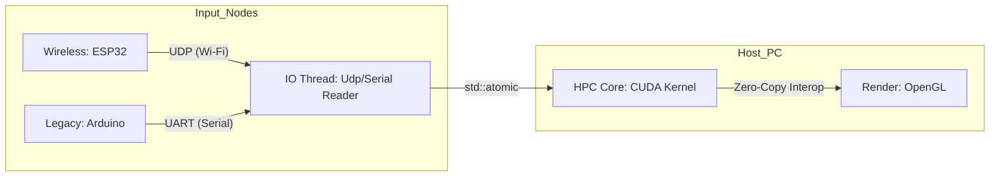

# CUDA Learning Journey

This repository documents my progress in mastering CUDA programming and High-Performance Computing (HPC).
My goal is to understand the hardware architecture deeply and write highly optimized kernels.

## Environment
- **GPU:** NVIDIA GeForce RTX 3070 Laptop GPU
- **IDE:** Visual Studio 2022
- **Toolkit:** CUDA 13.1
- **Profiler:** NVIDIA Nsight Compute / Nsight Systems

## Project List

| # | Project | Key Concepts | Status |
|:-:|:---|:---|:---|
| 01 | [Vector Addition](./CudaStudy/01_Add) | Grid-Stride Loop, Unified Memory, Profiling | Done |
| 02 | [Matrix Multiplication](./CudaStudy/02_MatrixMultiplication) | Shared Memory, Tiling, Vectorized Access (float4) | Done |
| 03 | [Parallel Reduction](./CudaStudy/03_ParallelReduction) | Warp Divergence, Loop Unrolling, Volatile, Bank Conflicts | Done |
| 04 | [N-Body Simulation](./CudaStudy/04_NBodySimulation) | Compute vs Memory Bound, Tiling, Thread Coarsening, Occupancy | Done |
| 05 | Spatial Partitioning | Uniform Grid, Atomic Operations | Integrated into Project 06 |
| 06 | [Heterogeneous HPC System](./CudaStudy/06_Heterogeneous_HPC) | Wireless UDP, CUDA-GL Interop, Swarm Logistics | **In Progress** |

---

## Current Focus: Project 06 - Heterogeneous HPC Simulation System

This project builds a comprehensive control pipeline that bridges **Low-level Hardware**, **System Programming**, and **High-Performance Computing**. It now supports both wired (Bare-metal) and wireless (UDP) telemetry.

### System Architecture
The system simulates an **Edge Computing** environment where an external input node (ESP32 or Arduino) controls a massive particle simulation ($N=16,384$) in real-time via a dedicated I/O thread.

**(Text Representation)**
`[ESP32/Arduino]` --(UDP/UART)--> `[IO Thread: Receiver]` --(Atomic Memory)--> `[HPC Core: CUDA Kernel]` --(Interop)--> `[Render: OpenGL]`

### Key Technical Objectives & Results
- **Wireless Modernization:** Implemented **UDP Telemetry** via ESP32-S3 (SoftAP) and C++ WinSock2, breaking physical USB constraints.
- **HPC Core (CUDA & OpenGL):** Zero-copy rendering with Spatial Partitioning (Uniform Grid) for real-time performance.
- **Embedded Interface (Bare-metal):** Direct register manipulation (`ADMUX`, `UBRR0`) replacing standard Arduino libraries for ultra-low latency.

**[View Full Project & Code](./CudaStudy/06_Heterogeneous_HPC)**

---

## Future Roadmap: From Simulation to Solution

### Goal 1: Logistics Swarm Simulator (Ongoing)
Transforming simple boids into a massive Multi-Agent Pathfinding (MAPF) simulation mimicking thousands of AGVs in a warehouse.
- **Environmental Physics:** Implemented a potential field using constant memory to handle static obstacles parsed from 2D floor plans. *(Done)*
- **HPC Routing:** Transitioning from individual A* to **Vector Flow Fields** to achieve $O(1)$ path lookup for massive agent counts. *(Next)*
- **Local Avoidance:** Implementing GPU-accelerated collision avoidance to resolve traffic deadlocks in narrow corridors.

### Goal 2: Unified HPC Sandbox Architecture
Consolidating standalone projects into a single, cohesive engine framework.
- **Framework:** Integrating **Dear ImGui** over the GLFW/OpenGL pipeline.
- **System Design:** Abstracting simulations into a `Scene` management system.

### Goal 3: Cross-Platform HPC Deployment (AMD ROCm)
Expanding the system's hardware abstraction by porting the CUDA-based simulation to the **AMD ROCm (HIP)** ecosystem.
- **Objective:** Cross-validate the simulation's throughput across different GPU architectures.